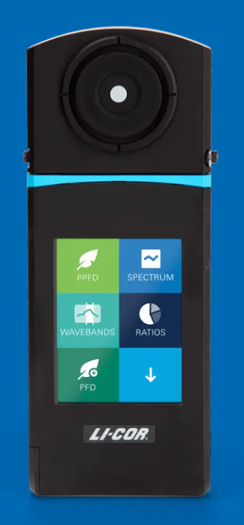

# Spectrometro LI-180
<div align="center">
  <a href="https://www.licor.com/products/light/spectrometer">
    
  </a>
</div>


Este repositório contém scripts, funções e dados para análise e visualização de espectros medidos com espectrômetro, além de ferramentas para tratamento de dados e geração de gráficos.

## 📁 Estrutura do Projeto

- **plot_spectra/** 📊: Scripts em R para leitura, processamento e plotagem de espectros. Inclui funções auxiliares, gráficos gerados e dados de referência.
  - `main.R`: Script principal para análise e plotagem de espectros.
  - `functions.R`: Funções auxiliares para manipulação dos dados.
  - `spectrometer_sun.R`: Script para espectros solares.
  - `dados/`: Dados brutos e de referência (arquivos `.txt`, `.RDS`, `.xlsx`).
  - `outputs/`: Gráficos e imagens gerados pelos scripts.
- **TratarDadosPlotSurface/** 🐍: Scripts em Python para tratamento de dados de superfície e geração de gráficos.
  - `main.py`: Script principal para processar e plotar dados de superfície.
  - `functions.py`: Funções auxiliares para manipulação dos dados.
  - `coordenadas.csv`: Arquivo de coordenadas para análise espacial.
  - Subpastas (ex: `0A/`, `0B/`, etc): Contêm arquivos de dados espectrais para diferentes amostras ou pontos de coleta.
- **Spectros_ROOM_LAAC/**: Dados de espectros coletados em diferentes salas (RoomA, RoomB, etc).

## 💻 Como usar

1. Instale as dependências necessárias para R e Python conforme os scripts.
2. Para executar o processamento de dados do TratarDadosPlotSurface, basta dar um duplo clique no arquivo `Executar_TratarDadosPlotSurface.vbs` ⚡. Isso executará automaticamente o `main.py` sem abrir o terminal.
3. Você também pode executar os scripts principais em cada pasta manualmente, se preferir.
4. Consulte os arquivos de saída em `outputs/` e os dados brutos em `dados/` ou nas subpastas de `TratarDadosPlotSurface/`.

## ⚡ Execução automática do processamento

- O arquivo `Executar_TratarDadosPlotSurface.vbs` permite rodar o processamento do `main.py` com apenas um duplo clique, sem abrir janelas de terminal.
- Certifique-se de que o Python esteja instalado e configurado no PATH do sistema.
- O arquivo `.vbs` pode ser colocado junto à pasta do projeto e funcionará em qualquer local do computador.

## ℹ️ Observações

- Consulte os scripts e funções para detalhes sobre parâmetros e formatos de entrada.
- O arquivo `Forma_de_uso.md` em `TratarDadosPlotSurface/` traz instruções específicas para uso dos scripts Python.
****
## 🆕 Novidades e melhorias recentes

- A interface gráfica está mais organizada, com opções de interpolação e escolha de variável (PPFD/PFD) separadas em subseções.
- Os botões de interpolação agora têm destaque azul quando selecionados, facilitando a visualização.
- Ao tentar organizar arquivos, o sistema avisa se não houver arquivos válidos para mover, evitando confusões.
- Mensagens de feedback e confirmação mais claras em todas as ações principais.

## 📦 Dependências

### R

Os scripts em `plot_spectra/` utilizam pacotes comuns para análise e visualização de dados. Instale-os com:

```r
install.packages(c("tidyverse", "readxl", "data.table", "ggplot2"))
```

### Python 🐍

Os scripts em `TratarDadosPlotSurface/` utilizam bibliotecas populares para análise de dados e gráficos. Instale-os com:

```bash
pip install pandas numpy matplotlib seaborn openpyxl
```

> Certifique-se de estar no ambiente virtual desejado antes de instalar as dependências Python.